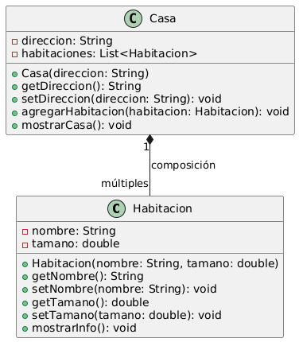
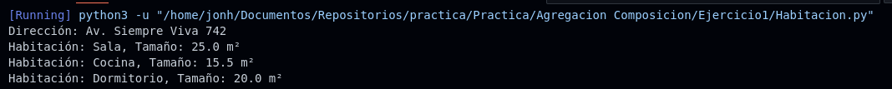

# Ejercicio 1 - Casa y Habitación

**Tema:** Composición de Objetos

## Enunciado

1. Sean las siguientes clases:

- **Habitación** `<nombre, tamaño (en metros cuadrados)>`  
  **Métodos:** `mostrar_info()` → muestra el nombre y tamaño de la habitación.

- **Casa** `<dirección, habitaciones (lista de objetos de tipo Habitación)>`  
  **Métodos:** `agregar_habitacion(habitacion)`, `mostrar_casa()` → muestra la dirección y la información de todas las habitaciones.

a) Implementa las clases con sus constructores, getters y setters.  
b) Crea una casa y agrega varias habitaciones.  
c) Muestra la información de la casa y sus habitaciones.

## Archivos

- [Habitacion.java](./Habitacion.java)
- [Habitacion.py](./Habitacion.py)

## Diagrama

- 

## Ejecución

### Python

- 
