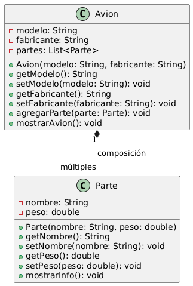
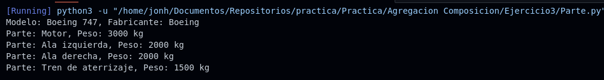

# Ejercicio 3 - Avión y sus Partes

**Tema:** Composición de Objetos

## Enunciado

3. Crea un modelo POO de clases para representar un avión y sus partes.

- El **avión** está compuesto por partes como el motor, las alas y el tren de aterrizaje.
- Si el avión se destruye, las partes también se destruyen (composición).

**Clases:**

- **Parte** `<nombre, peso (en kg)>`

a) Implementa las clases con sus constructores, getters y setters.  
b) Crea un avión compuesto por varias partes.  
c) Muestra la información del avión y cada una de sus partes.

## Archivos

- [Parte.java](./Parte.java)
- [Parte.py](./Parte.py)

## Diagrama

- 

## Ejecución

### Python

- 
