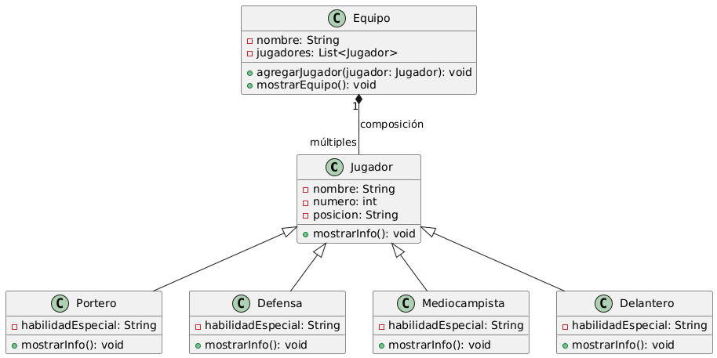
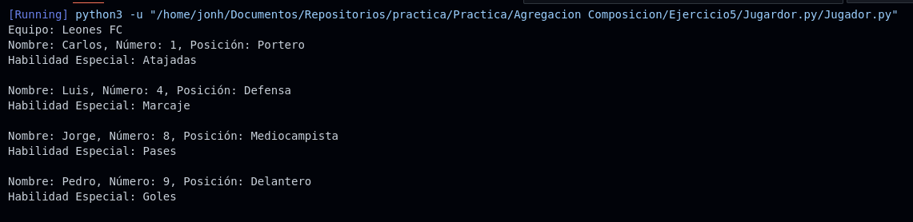

# Ejercicio 5 - Equipo de Fútbol

**Tema:** Composición y Herencia

## Enunciado

5. Desarrolla un modelo POO para representar un equipo de fútbol y sus jugadores.  
El equipo está **compuesto** por jugadores, y si el equipo se destruye, los jugadores también se destruyen (relación de composición).  
Además, los jugadores pueden ser de diferentes tipos: **portero, defensa, mediocampista, delantero**.

### Clases:

- **Jugador** `<nombre, número, posición>`  
  Métodos: `mostrar_info()` – Muestra el nombre, número y posición del jugador.

- **Clases Derivadas:**  
  `Portero`, `Defensa`, `Mediocampista`, `Delantero` (heredan de `Jugador`)  
  Atributo adicional: `habilidad_especial` (ej: "Atajadas", "Marcaje", "Pases", "Goles")

- **Equipo** `<nombre, jugadores (lista de objetos de tipo Jugador)>`  
  Métodos: `agregar_jugador(jugador)`, `mostrar_equipo()` – Muestra el nombre del equipo y la información de todos los jugadores.

### Actividades:

a) Implementa las clases con sus constructores, getters y setters.  
b) Crea un equipo y agrega varios jugadores de diferentes tipos.  
c) Muestra la información del equipo y sus jugadores.

## Archivos

- [Jugador.java](./Jugador.java)
- [Jugador.py](./Jugador.py)

## Diagrama

- 

## Ejecución

### Python

- 
