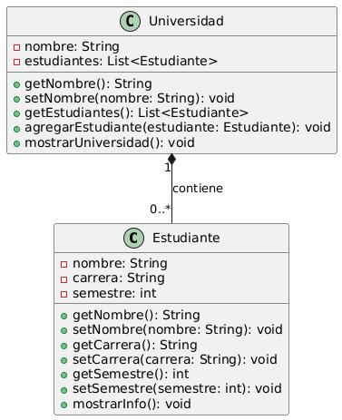
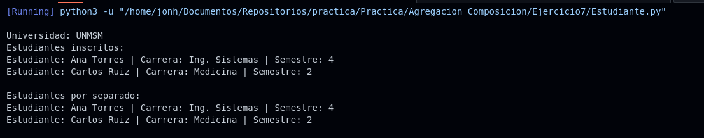

# Ejercicio 7 - Universidad y Estudiantes

**Tema:** Agregación

## Enunciado

7. Crea un modelo POO para representar una universidad y sus estudiantes.  
La **universidad contiene estudiantes**, pero los estudiantes pueden existir **independientemente** de la universidad (relación de agregación).

### Clases:

- **Estudiante** `<nombre, carrera, semestre>`  
  Métodos: `mostrar_info()` – Muestra el nombre, carrera y semestre del estudiante.

- **Universidad** `<nombre, estudiantes (lista de objetos de tipo Estudiante)>`  
  Métodos: `agregar_estudiante(estudiante)`, `mostrar_universidad()` – Muestra el nombre de la universidad y la información de todos los estudiantes.

### Actividades:

a) Implementa las clases con sus constructores, getters y setters.  
b) Crea una universidad y agrega varios estudiantes.  
c) Muestra la información de la universidad y sus estudiantes.

## Archivos

- [Estudiante.java](./Estudiante.java)
- [Estudiante.py](./Estudiante.py)

## Diagrama

- 

## Ejecución

### Python

- 
