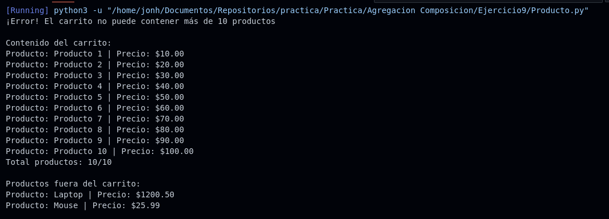

# Ejercicio 9 - Carrito de Compras y Productos

**Tema:** Agregación

## Enunciado

9. Crea un modelo POO para representar un carrito de compras y sus productos.  
El carrito contiene productos, pero los productos pueden existir independientemente del carrito.  
Además, el carrito no puede contener más de 10 productos.

### Clases:

- **Producto** `<nombre, precio>`  
  Métodos: `mostrar_info()` – Muestra el nombre y el precio del producto.

- **CarritoCompras** `<productos (lista de objetos de tipo Producto)>`  
  Métodos: `agregar_producto(producto)`, `mostrar_carrito()` – Muestra la información de todos los productos en el carrito.

### Actividades:

a) Implementa las clases con sus constructores, getters y setters.  
b) Crea un carrito de compras y agrega varios productos, validando que no se exceda el límite de 10 productos.  
c) Muestra la información del carrito y sus productos.

## Archivos

- [Producto.java](./Producto.java)
- [Producto.py](./Producto.py)

## Diagrama

- 

## Ejecución

### Python

- 
