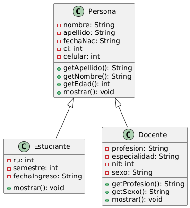
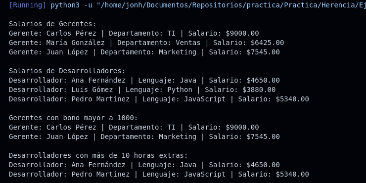

# Ejercicio 3

**Tema:** Herencia

## Enunciado

1. Modelar diferentes tipos de vehículos. Las clases deben tener las siguientes características:

- **Vehículo** `<marca, modelo, año, precio_base>`  
  - **Métodos:** `mostrar_info()` muestra la información básica del vehículo.

- **Coche** (hereda de Vehículo) `<num_puertas, tipo_combustible>`  
  - **Métodos:** `mostrar_info()` debe mostrar la información básica más los atributos adicionales.

- **Moto** (hereda de Vehículo) `<cilindrada, tipo_motor>`  
  - **Métodos:** `mostrar_info()` debe mostrar la información básica más los atributos adicionales.

**a)** Implementa las clases con sus constructores, getters y setters.  
**b)** Crea instancias de `Coche` y `Moto` y muestra su información usando el método `mostrar_info()`.  
**c)** Muestra todos los coches que tienen más de 4 puertas.  
**d)** Mostrar los coches y motos actuales (gestión 2025).

## Archivos

- [Persona.java](./Persona.java)
- [Persona.py](./Persona.py)

## Diagrama

- 

## Ejecución

### Python

- 
