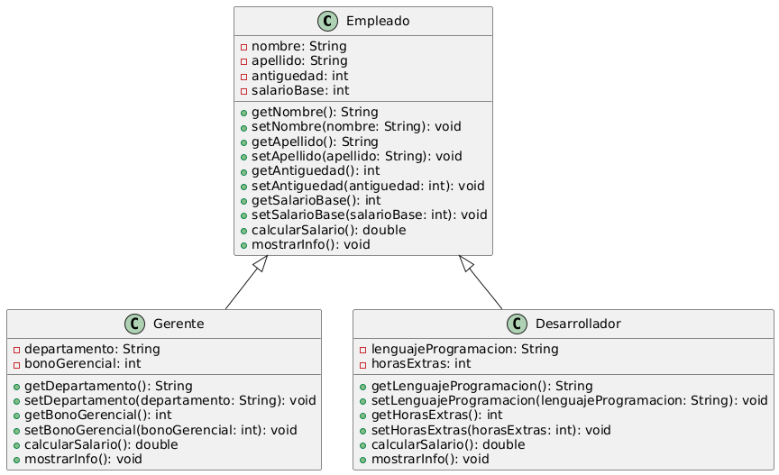
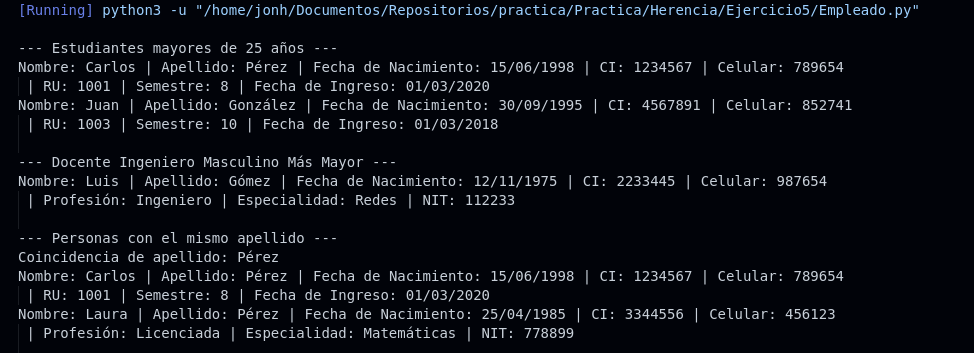

# Ejercicio 5 - Empleado y Gerente

**Tema:** Herencia y Sobrescritura de Métodos

## Enunciado

5. Definir las siguientes clases:

- **Empleado** `<nombre, apellido, salario_base, años_antigüedad>`  
  **Métodos:** `calcular_salario()` → retorna el salario base más un bono del 5% por cada año de antigüedad.

- **Gerente** (hereda de Empleado) `<departamento, bono_gerencial>`

## Archivos

- [Empleado.java](./Empleado.java)
- [Empleado.py](./Empleado.py)

## Diagrama

- 

## Ejecución

### Python

- 
