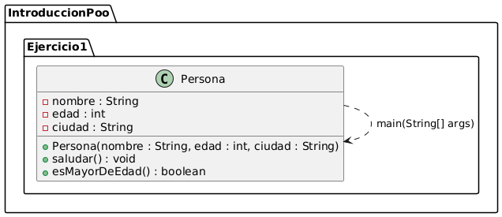
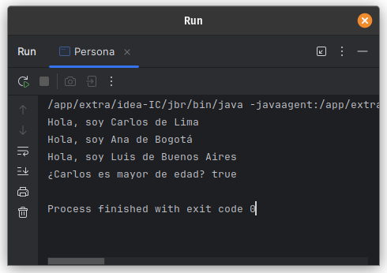
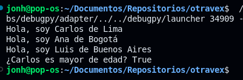

# Ejercicio 1 - Persona

**Tema:** Introducción a la Programación Orientada a Objetos

## Enunciado

1. Crea una clase `Persona` con `nombre`, `edad` y `ciudad`.  
   a) Agrega un método para mostrar el saludo: “Hola, soy {nombre} de {ciudad}”.  
   b) Crea tres personas y muestra su saludo.  
   c) Agrega un método para verificar si es mayor de edad.

## Archivo

- [Persona.java](./Persona.java)
- [Persona.py](./Persona.py)

## Diagrama

- 

## Ejecución

### java

- 

### python

- 