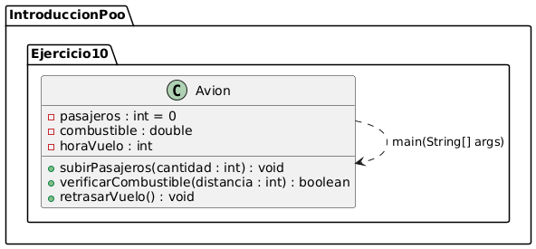
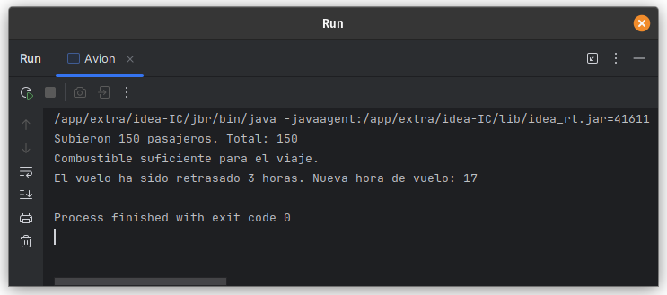

# Ejercicio 10 - Avión

**Tema:** Introducción a la Programación Orientada a Objetos

## Enunciado

10. Realiza la abstracción de un avión.  
   a)w Al avión desean subir una X cantidad de pasajeros, actualiza los datos.  
   b) Verifica el combustible disponible según la distancia (12 litros por km).  
   c) El vuelo se retrasó, actualiza la hora del vuelo con 3 horas de retraso.  
   d) Crea una instancia y utiliza los métodos anteriores.

## Archivo

- [Avion.java](./Avion.java)

## Diagrama

- 

## Ejecución

- 
