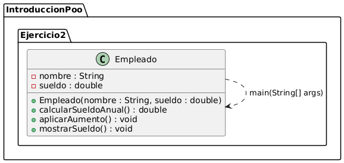
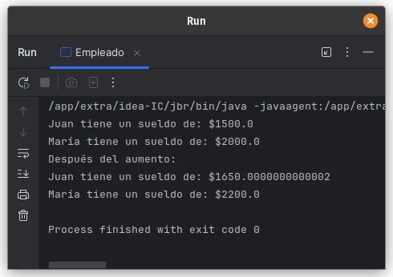

# Ejercicio 2 - Empleado

**Tema:** Introducción a la Programación Orientada a Objetos

## Enunciado

2. Crea una clase `Empleado` con `nombre` y `sueldo`.  
   a) Agrega un método para calcular el sueldo anual.  
   b) Agrega un método para aplicar un aumento del 10%.  
   c) Crea dos empleados y muestra sus sueldos antes y después del aumento.

## Archivo

- [Empleado.java](./Empleado.java)

## Diagrama

- 

## Ejecución

- 
