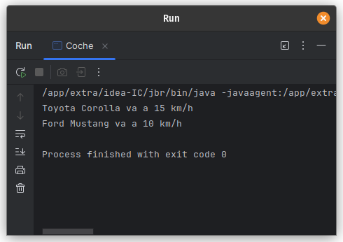

# Ejercicio 3 - Coche

**Tema:** Introducción a la Programación Orientada a Objetos

## Enunciado

3. Crea una clase `Coche` con `marca`, `modelo` y `velocidad`.  
   a) Agrega un método `acelerar()` que aumente la velocidad en 10.  
   b) Agrega un método `frenar()` que disminuya la velocidad en 5.  
   c) Crea dos coches, aceléralos, frénalos y muestra sus velocidades.

## Archivo

- [Coche.java](./Coche.java)

## Diagrama

- 

## Ejecución

- 
