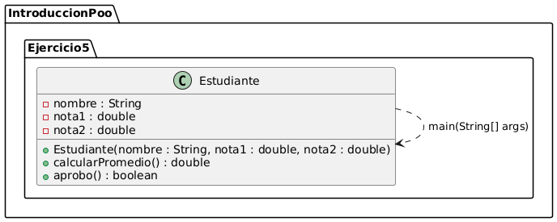
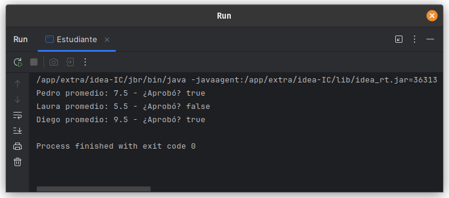

# Ejercicio 5 - Estudiante

**Tema:** Introducción a la Programación Orientada a Objetos

## Enunciado

5. Crea una clase `Estudiante` con `nombre`, `nota_1`, `nota_2`.  
   a) Agrega un método para calcular el promedio.  
   b) Agrega un método para verificar si aprobó (promedio >= 6).  
   c) Crea tres estudiantes, muestra sus promedios y si aprobaron.

## Archivo

- [Estudiante.java](./Estudiante.java)

## Diagrama

- 

## Ejecución

- 
