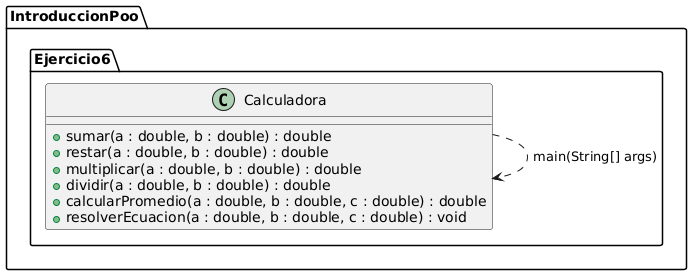
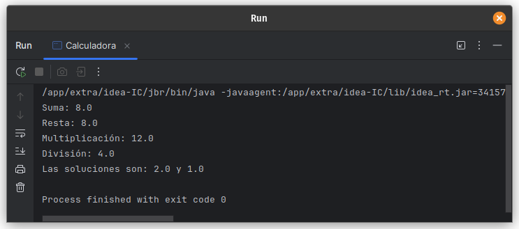

# Ejercicio 6 - Calculadora

**Tema:** Introducción a la Programación Orientada a Objetos

## Enunciado

6. Crea una clase `Calculadora` con operaciones básicas.  
   a) Agrega métodos para realizar las operaciones básicas.  
   b) Agrega un método para calcular el promedio de tres números.  
   c) Agrega un método para calcular las soluciones de una ecuación cuadrática.  
   d) Realiza operaciones con los métodos y muestra los resultados.

## Archivo

- [Calculadora.java](./Calculadora.java)

## Diagrama

- 

## Ejecución

- 
