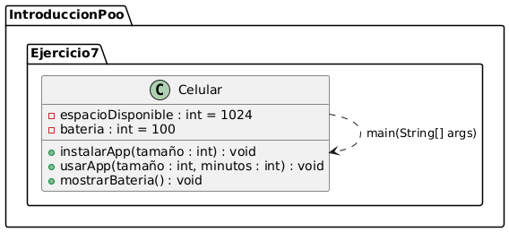
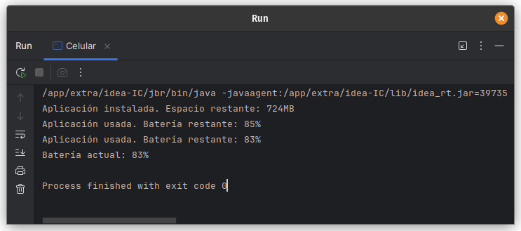

# Ejercicio 7 - Celular

**Tema:** Introducción a la Programación Orientada a Objetos

## Enunciado

7. Crea una clase `Celular` con espacio para 20 aplicaciones o 1024Mb de espacio.  
   a) Crea un método para instalar una nueva aplicación.  
   b) Crea un método para utilizar una aplicación:  
      - Si pesa más de 100Mb usa 2% de batería cada 10 min.  
      - Si pesa más de 250Mb usa 5% cada 10 min.  
      - En otros casos usa 1% cada 10 min.  
   c) Muestra el porcentaje de batería restante.  
   d) Cuando la batería se acabe al tratar de usar el celular debe mostrar el mensaje de "celular apagado".

## Archivo

- [Celular.java](./Celular.java)

## Diagrama

- 

## Ejecución

- 
