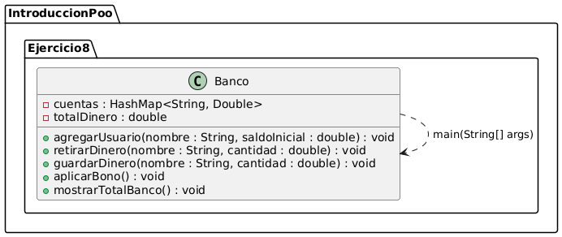
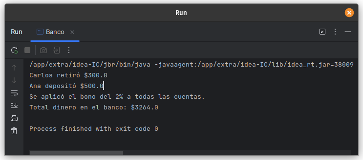

# Ejercicio 8 - Banco

**Tema:** Introducción a la Programación Orientada a Objetos

## Enunciado

8. Realiza la abstracción de un banco que atiende a 10 usuarios con cuenta de ahorros.  
   a) Crea un método para agregar un usuario.  
   b) Realiza un método para que un usuario pueda retirar dinero.  
   c) Realiza un método para que un usuario pueda guardar dinero.  
   d) Dales a los usuarios un 2% de bono respecto a su saldo.  
   e) Muestra el total de dinero que posee el banco.

## Archivo

- [Banco.java](./Banco.java)

## Diagrama

- 

## Ejecución

- 
