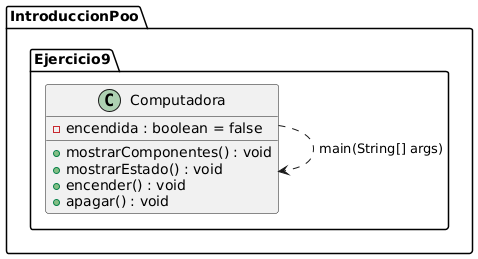
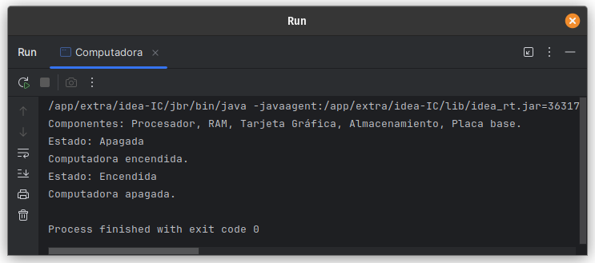

# Ejercicio 9 - Computadora

**Tema:** Introducción a la Programación Orientada a Objetos

## Enunciado

9. Realiza la abstracción de una computadora.  
   a) Muestra los componentes principales de la computadora.  
   b) Muestra el estado de la computadora (encendido o apagado).  
   c) Crea una instancia y simula encender y apagar la computadora.

## Archivo

- [Computadora.java](./Computadora.java)

## Diagrama

- 

## Ejecución

- 
