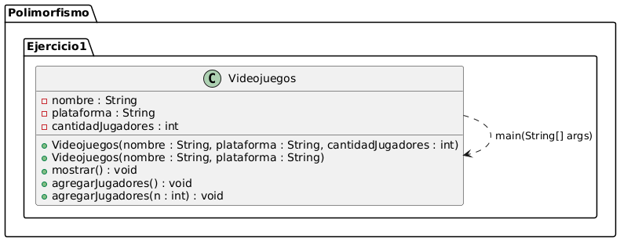
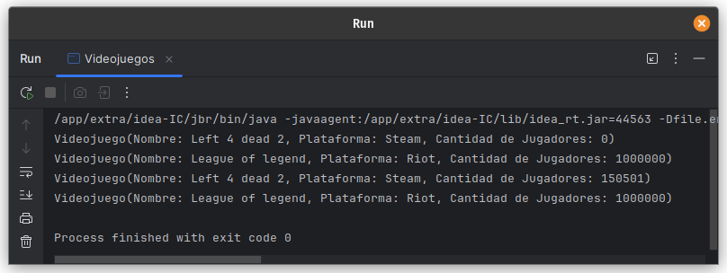

# Ejercicio 01 - Videojuego (Polimorfismo)

## Enunciado

Sea la clase Videojuego:

1. a) Instanciar al menos 2 videojuegos  
   b) Sobrecargar el constructor 2 veces  
   c) Implementar un método `mostrar()`  
   d) Sobrecargar el método `agregarJugadores()` donde en el primero se agregue solo 1 jugador y en otro se ingrese una cantidad de jugadores a aumentar.

## Archivo

- [Videojuegos.java](./Videojuegos.java)

## Diagrama

- 

## Ejecución

- 
