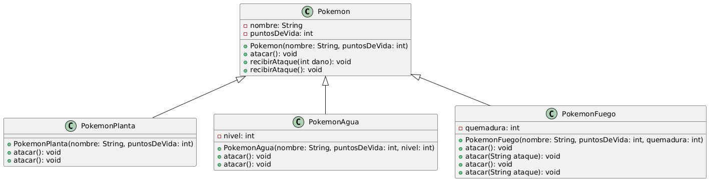
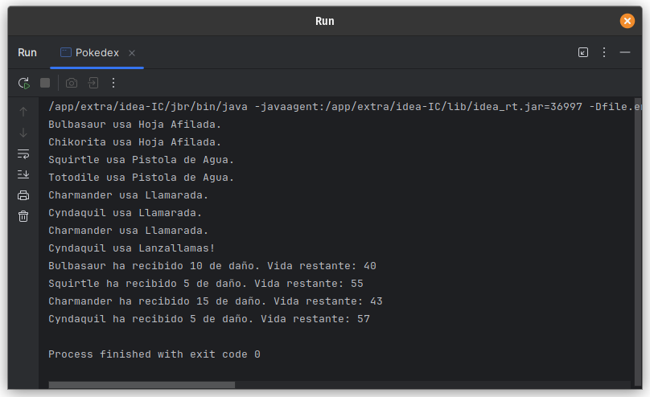

# Ejercicio 10 - Pokedex (Polimorfismo)

## Enunciado

Se desarrolla un Pokedex donde se usarán las siguientes clases:

10. a) Crea e instancia al menos 2 pokemones de cada tipo.  
    b) Sobrescribe `atacar()` en `PokemonAgua`, `PokemonFuego` y `PokemonPlanta`, haciendo que el ataque varíe según el tipo de Pokémon.  
    c) Sobrecarga `atacar()` en `PokemonFuego` para permitir ataques con y sin nombre específico (por ejemplo, `atacar()` usa un ataque por defecto, mientras que `atacar(String ataque)` permite especificar uno).  
    d) Sobrecarga `recibirAtaque(int daño)` y `recibirAtaque()` en la clase `Pokemon` y sobrescríbelo en las subclases para reducir puntos de vida según el tipo de ataque recibido (si es el primero, reduces los puntos de vida ingresados, y si es el segundo reduces solo 5 puntos de vida).

## Archivo

- [Pokedex.java](./Pokedex.java)

## Diagrama

- 

## Ejecución

- 