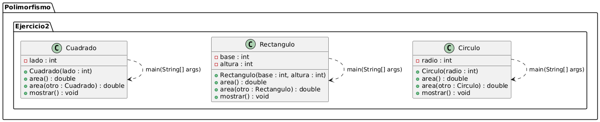
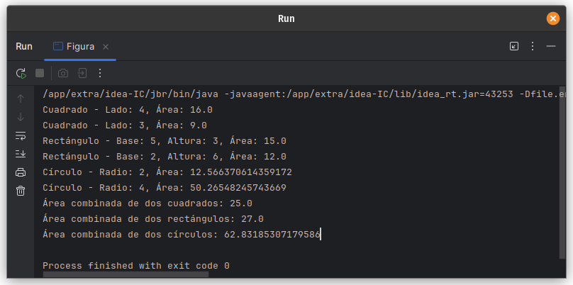

# Ejercicio 02 - Figuras (Polimorfismo)

## Enunciado

Sean las siguientes clases que hacen referencia a diferentes tipos de figura:

2. a) Instanciar 1 Cuadrado, 1 Rectángulo y 1 Círculo  
   b) Implementar un método `mostrar()` en cada clase para imprimir sus dimensiones y área.  
   c) Sobrecargar el método `Área` para mostrar el área de todas las figuras.

## Archivo

- [Figuras.java](./Figuras.java)

## Diagrama

- 

## Ejecución

- 
