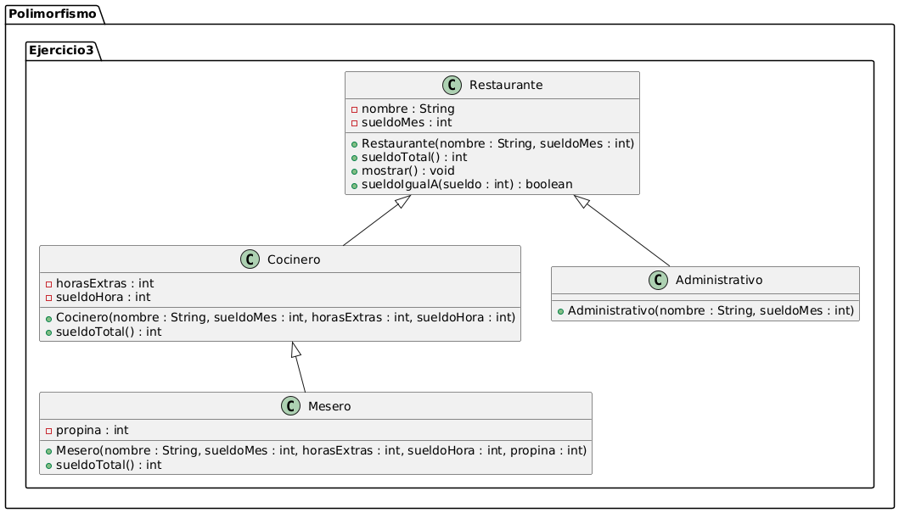
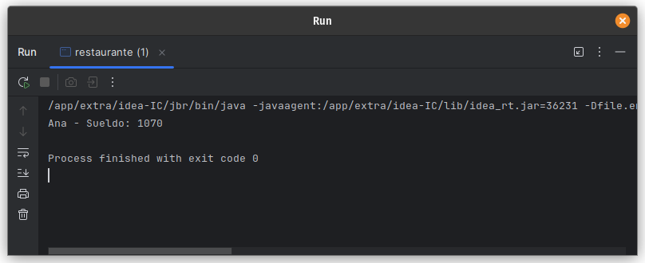
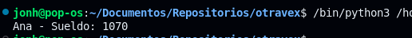

# Ejercicio 03 - Restaurante (Polimorfismo)

## Enunciado

Un restaurante organiza a su personal mediante las siguientes clases:

3. a) Instanciar 1 Cocinero, 2 objetos Mesero y 2 objetos Administrativo.  
   b) Sobrecargar el método `SueldoTotal()` para mostrar el sueldo total, sumándole las horas extra, considerando el sueldo por hora y la propina en caso de los meseros.  
   c) Sobrecargar el método para mostrar a aquellos Empleados que tengan `SueldoMes` igual a X.

## Archivo

- [restaurante.java](./restaurante.java)
- [Restaurante.py](./Restaurante.py)

## Diagrama

- 

## Ejecución

### java

- 

### python

- 
