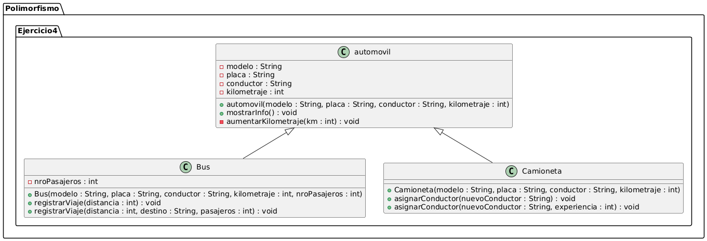
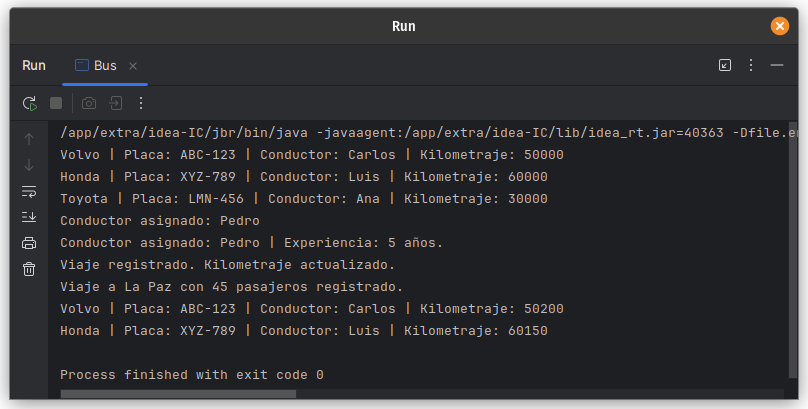

# Ejercicio 04 - Automóviles (Polimorfismo)

## Enunciado

Sean las siguientes clases que detallan 2 tipos de automóviles:

4. a) Instanciar 2 objetos Bus y 1 objeto Camioneta  
   b) Sobrecargar el método `asignarConductor()` en Camioneta, donde primero solo se añada el nombre del conductor, y el segundo añada al conductor y pida años de experiencia para mostrarlo junto a su nombre.  
   c) Sobrecargar el método `registrarViaje()` en Bus, donde se pida una distancia y esta misma se aumente al kilometraje, y en otro que se pida distancia, lugar de destino y nroPasajeros.

## Archivo

- [automovil.java](./automovil.java)

## Diagrama

- 

## Ejecución

- 
