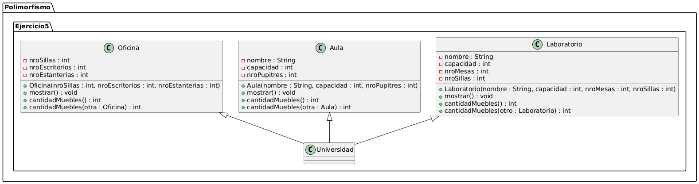
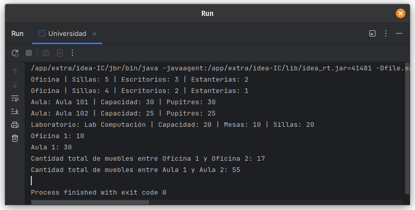

# Ejercicio 05 - Universidad (Polimorfismo)

## Enunciado

Se hace referencia a algunos de los diferentes ambientes de la Universidad mediante las siguientes clases:

5.
  a) Instanciar 2 objetos Oficina,2 Aulas y 1 Laboratorio.
  b) Crear un método mostrar() para mostrar los datos de cada objeto.
  c) Sobrecargar el método cantidadMuebles(), para conocer el número total de muebles dentro de cada ambiente.

## Archivo

- [Universidad.java](./Universidad.java)

## Diagrama

- 

## Ejecución

- 
