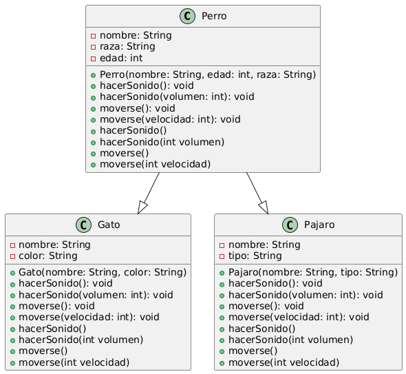
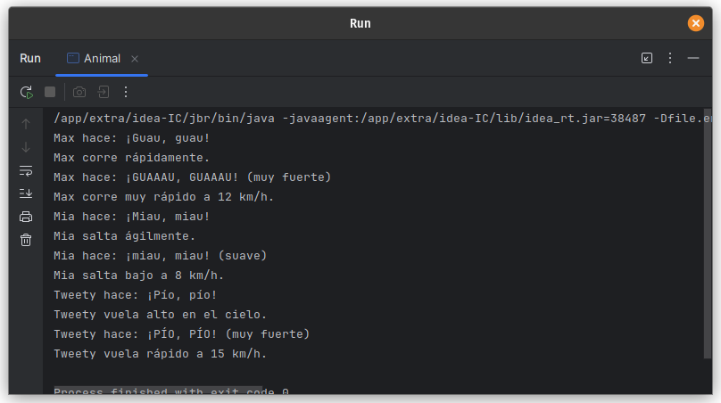

# Ejercicio 07 - Animales (Polimorfismo)

## Enunciado

Se hace referencia a algunos animales mediante las siguientes clases:

7. a) Instanciar 1 Perro, 1 Gato y 1 Pájaro.  
   b) Sobrecargar el método `hacerSonido()` para que cada animal emita su sonido característico.  
   c) Implementar un método `moverse()` que indique cómo se mueve cada animal (correr, saltar, volar, etc.).

## Archivo

- [Animal.java](./Animal.py)

## Diagrama

- 

## Ejecución

- 