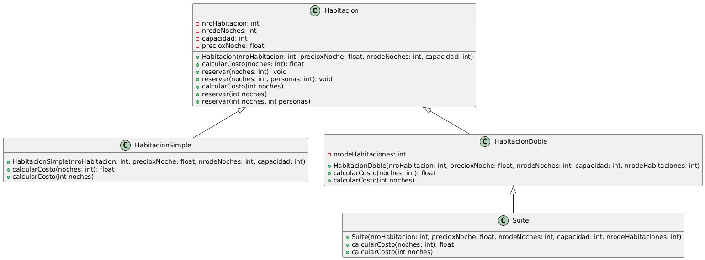
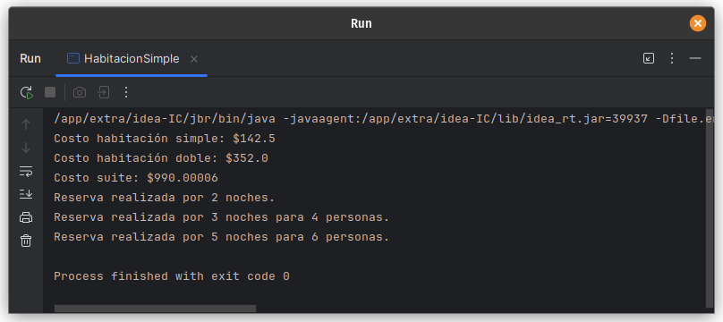

# Ejercicio 08 - Habitaciones (Polimorfismo)

## Enunciado

Para la reserva de habitaciones se guía por las siguientes clases:

8. a) Instanciar 1 objeto de cada tipo de habitación.  
   b) Implementa el método `calcularCosto(int noches)`, sobrescribiéndolo en `HabitacionSimple`, `HabitacionDoble` y `Suite`, aplicando distintos costos por noche.  
   c) Sobrecarga el método `reservar()` permitiendo reservar con diferentes parámetros (por número de noches o incluyendo el número de personas).

## Archivo

- [Habitacion.java](./Habitacion.py)

## Diagrama

- 

## Ejecución

- 