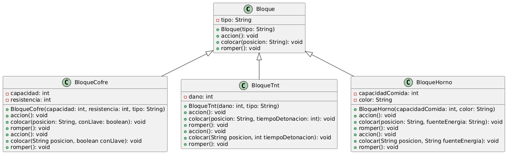
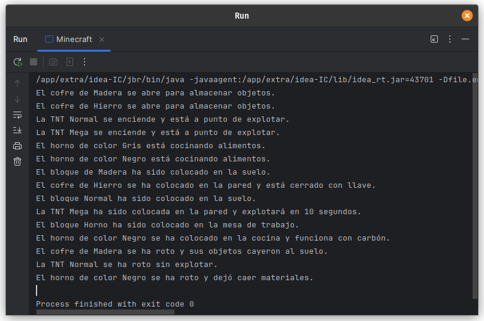

# Ejercicio 09 - Minecraft (Polimorfismo)

## Enunciado

Para los bloques del juego Minecraft se usará los siguientes objetos:

9. a) Crear e instanciar al menos 2 bloques de cada tipo.  
   b) Sobrescribe `accion()` en `BloqueCofre`, `BloqueTnt` y `BloqueHorno`, mostrando distintos mensajes según el tipo de bloque.  
   c) Sobrecarga `colocar()` para permitir colocar un bloque en diferentes orientaciones (por ejemplo, en el suelo o en la pared).  
   d) Sobrescribe `romper()` en `BloqueCofre`, `BloqueTnt` y `BloqueHorno`, mostrando distintos mensajes según el tipo de bloque y lo que sucede al romperlos.

## Archivo

- [Minecraft.java](./Minecraft.py)

## Diagrama

- 

## Ejecución

- 